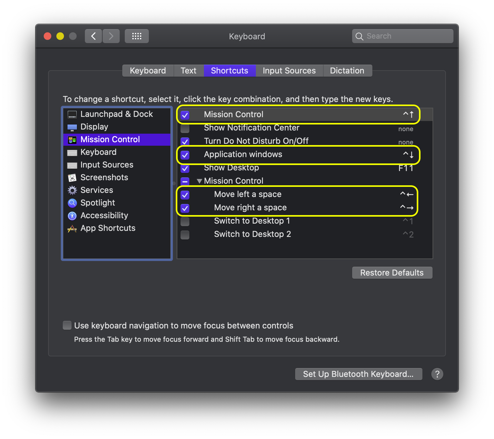
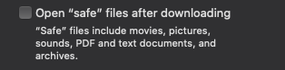

Typical Install (on macOS)
--------------------------

1.	First, install **Homebrew**: https://brew.sh
2.	Emacs is preferred editor, config dir `emacs.d` is installed below
	-	`brew info --cask emacs`
	-	`brew install --cask emacs`
	-	`emacs` .. [Show In Finder] .. Right-Click ... Open and Open
3.	Assumes [`stow`](stow/README.md#install-gnu-stow) and `git` are installed
	-	`brew install stow git keychain`

```shell
ssh-keygen -b 4096
# Upload this SSH key to GitHub account # cat ~/.ssh/id_rsa.pub | pbcopy
# and test # ssh -T git@github.com
cd
git clone --recurse-submodules https://github.com/idcrook/i-dotfiles.git .dotfiles
# git clone --recurse-submodules git@github.com:idcrook/i-dotfiles.git .dotfiles
cd .dotfiles
stow -t ~ stow
stow -vv @macos

stow -vv git
cp -v git/.config/git/config.secrets.example ~/.config/git/config.secrets
$EDITOR  ~/.config/git/config.secrets

stow -vv shell

stow -vv bash
cp -v bash/.config/shell/local.aliases.secrets.sh.example \
      bash/.config/shell/local.aliases.secrets.sh
$EDITOR bash/.config/shell/local.aliases.secrets.sh

stow -vv zsh
# see FIXUP below

stow -vv python

stow -vv homedir
cp -v homedir/{.ansiweatherrc.secrets.example,.ansiweatherrc.secrets}
cp -v homedir/{.wakatime.cfg.secrets.example,.wakatime.cfg.secrets}
cp -v ./homedir/bin/macos/homebrew/HOMEBREW_GITHUB_API_TOKEN.secrets.example \
      ./homedir/bin/macos/homebrew/HOMEBREW_GITHUB_API_TOKEN.secrets

# edit them

stow -vv espanso
# see espanso/README.md

TARGET=hostname
scp $TARGET:.config/espanso/user/personal.secrets.yml \
  ./espanso/.config/espanso/user/personal.secrets.yml

stow -vv emacs
stow -vv golang
stow -vv rustlang

# check the READMEs in the following
cd ~/.dotfiles/_homebrew
# ...
cd ~/.dotfiles/_pip
# ...
cd ~/.dotfiles/_npm
# ...
cd ~/.dotfiles/golang
# ...
cd ~/.dotfiles/rustlang
# ...
```

Some FIXUP
----------

See [MORE.md](../_homebrew/MORE.md) in Homebrew directory for more.

### Does zsh complain about un-safe directories?

```shell
compaudit
chmod 755 /usr/local/share/zsh
chmod 755 /usr/local/share/zsh/site-functions/
```

### Control-Space capture

#### Catalina 10.15.6 and later?

Things are reorganized. - In `System Preferences > Language & Region` there's a `preferred language" setting for Global and by App.

There is an `Input Sources` Tab in Catalina `System Preferences > Keyboard` where the additional Input Source can be added. However, the workaround to bring up Input Sources in the `System Preferences > Keyboard` tab now named `Shortcuts` does not seem to be required as the <kbd>Ctrl-SPACE</kbd> shortcuts are not enabled on a fresh Catalina install.


#### Prior

Via [https://forum.sublimetext.com/t/os-x-control-space-not-working/2145/3](https://forum.sublimetext.com/t/os-x-control-space-not-working/2145/3)

Control-Space is reserved by OS X for changing keyboard layouts. Unintuitively, you have to enable the feature to disable the keyboard shortcut (and free up the key combo). To do this:

-	Go to System Preferences > Language & Text > Input Sources

-	Check (turn on) at least two input sources in the left column

-	Click the “Keyboard Shortcuts…” button in the right column

-	Select Keyboard & Text Input on the left

-	Scroll to the bottom and disable “Select the previous input source – ^Space” on the right

-	Go back to System Preferences > Language & Text > Input Sources

-	Turn off the inputs on the left

### Control-ArrowKeys capture

DefaultSystem *Mission Control* Keyboard Shortcuts take over <kbd>Ctrl-<Arrow-key\></kbd> bindings.



Turn these off so that shell command line and Emacs editting can use them.


### Turn Safari "auto" unzip off

In `Safari >> Preferences > General` uncheck the Open "safe" files... option.


